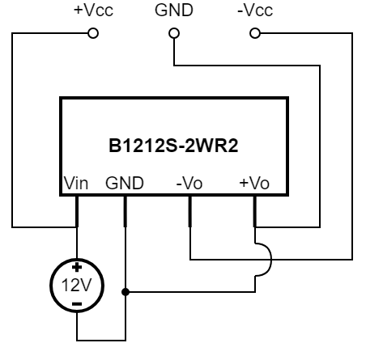
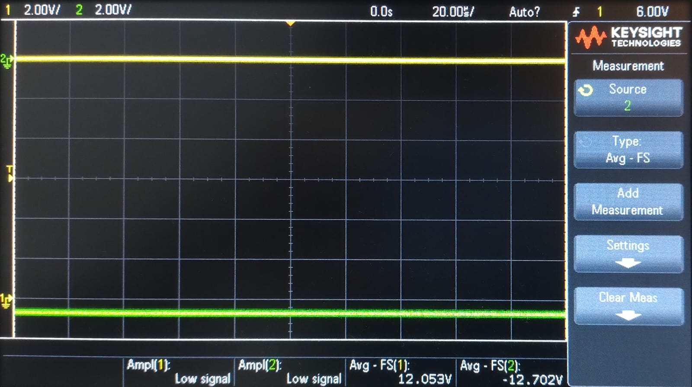
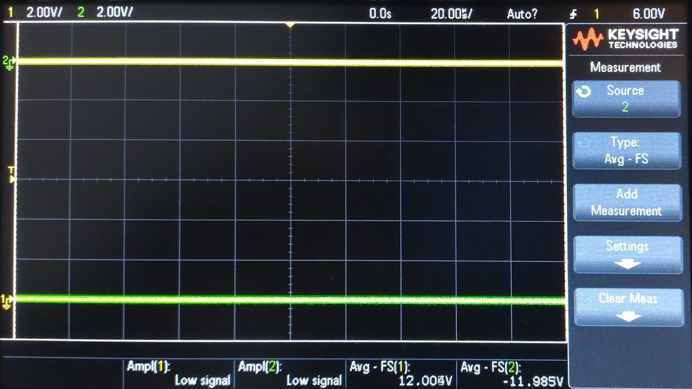

# B1212 S Test
Prueba de aplicación de la fuente asilada [B1212S-2WR2](https://www.micros.com.pl/mediaserver/info-dc%20a0505s-2wr2.pdf) 12V-12V para usar como fuente partida ±12V no aislada.

## Esquema de prueba

## Resultados
### Con carga de 10kΩ

### Con carga de 100Ω

## Observaciones
Notamos que con cargas bajas hay una diferencia de tensión importante, de 700mV entre las salidas. Esto pareciera ser para compensar la caída al acercarse a la potencia máxima de 2W. Al repetir la medición con cargas de 100Ω (1.44W) la diferencia es mínima.

Esto no debería representar un problema ya que la aplicación prevista es la alimentación de opamps.
